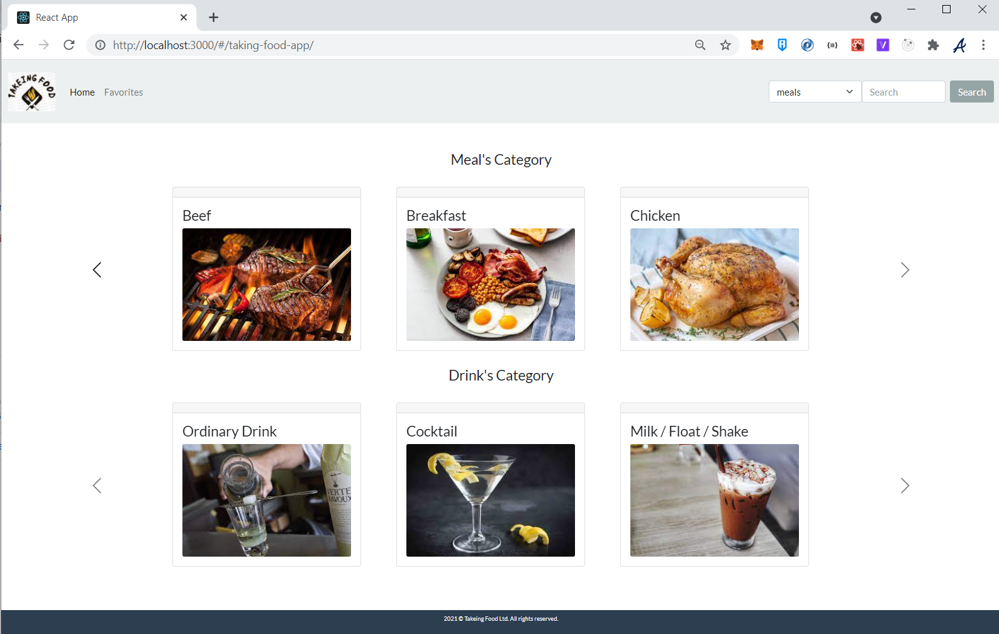
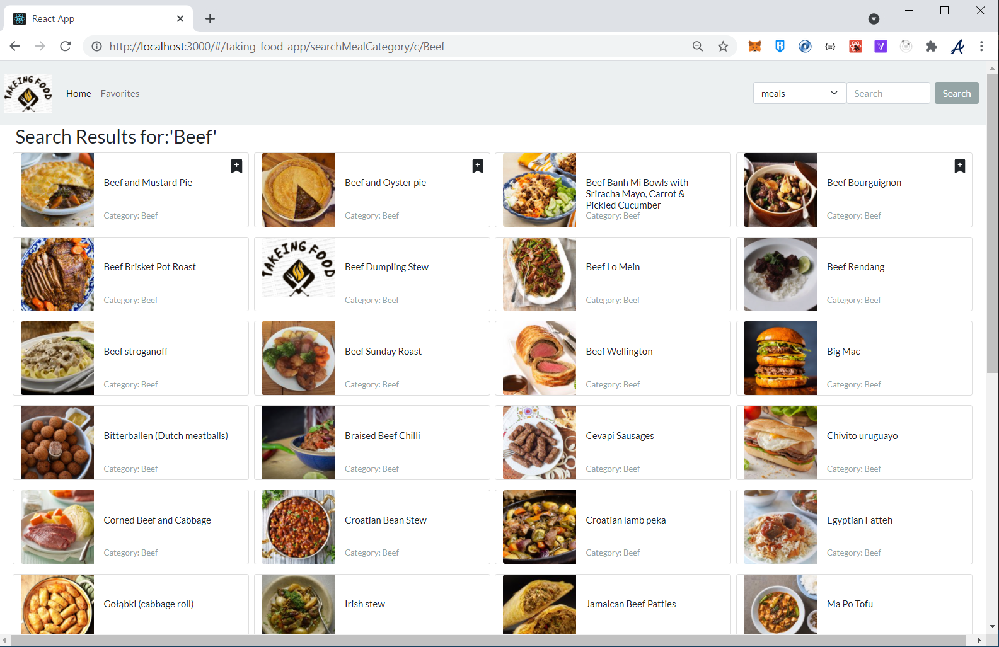
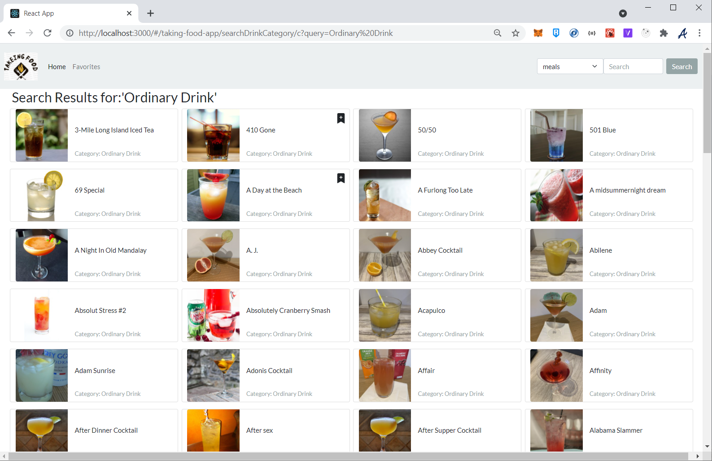
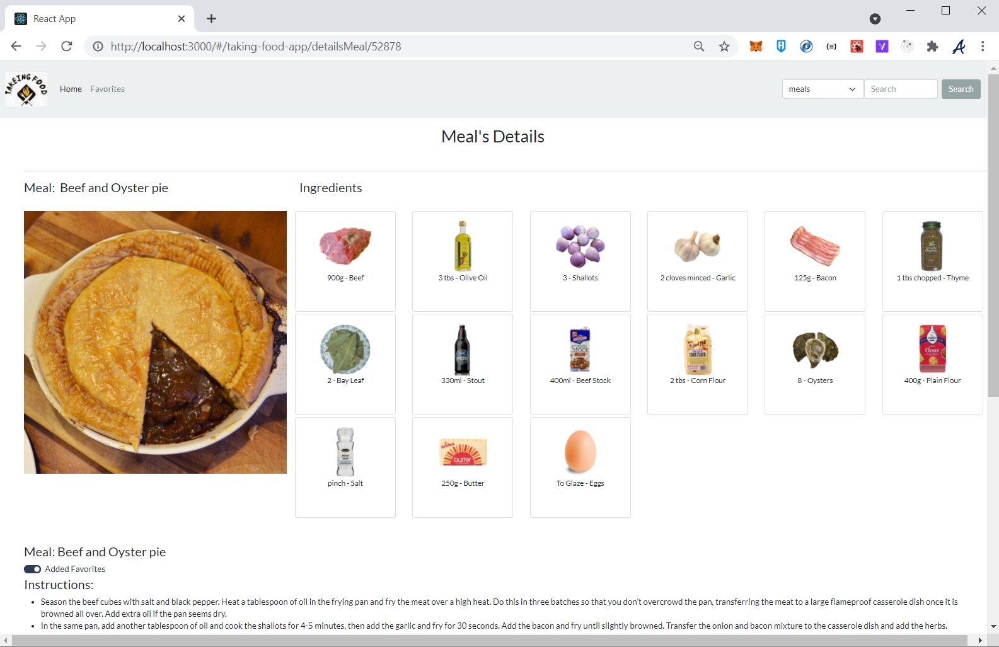
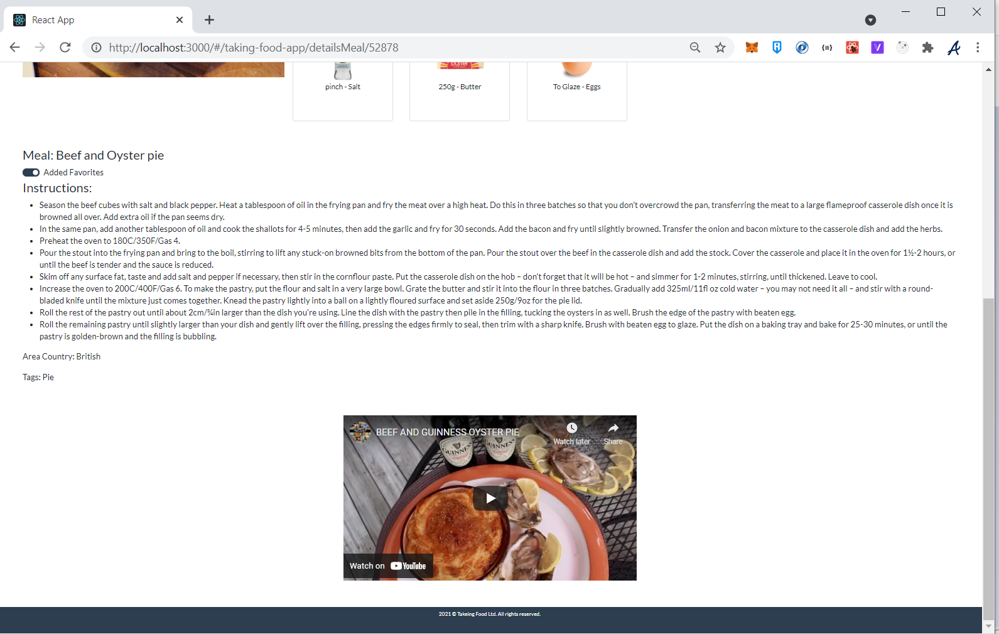
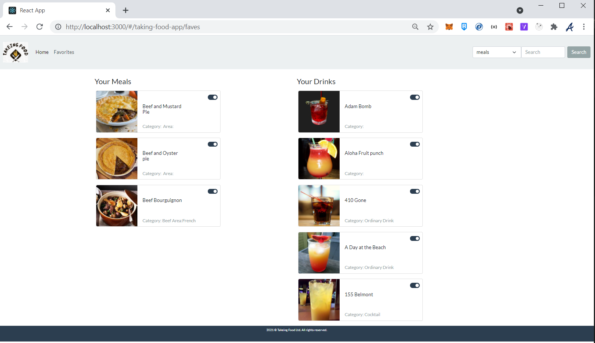

# Takeing Application

## Website's Link
https://javierramosscv.github.io/taking-food-app/

## Features 
- This application is a single page application in React with hooks and Bootstrap as the UI library. 
- Details:
    - Connection to third party Api's
    - Interaction between components using params
    - Implementation of React state
    - Implementation of React Router 
- This application is using two third party free Api's from:

### 1. https://www.thecocktaildb.com/api.php 
	
### EndPonits used:
```
Lookup full meal details by id
    www.themealdb.com/api/json/v1/1/lookup.php?i=52772

Search meal by name
    www.themealdb.com/api/json/v1/1/search.php?s=Arrabiata

List all Categories
    www.themealdb.com/api/json/v1/1/list.php?c=list

Filter by Category
    www.themealdb.com/api/json/v1/1/filter.php?c=Seafood
```
### 2. https://www.themealdb.com/api.php

### EndPonits used:
```		
Lookup full cocktail details by id
    www.thecocktaildb.com/api/json/v1/1/lookup.php?i=11007

List the categories
    www.thecocktaildb.com/api/json/v1/1/list.php?c=list

Search cocktail by name
    www.thecocktaildb.com/api/json/v1/1/search.php?s=margarita

Filter by Category
    www.thecocktaildb.com/api/json/v1/1/filter.php?c=Ordinary_Drink
```


			  

### Libraries used
     
	npm install bootswatch (Theme Flatly )
	
	npm install react-router react-router-dom
	
	npm install gh-pages --save-dev (deployment in github)


###  Reference links.


	Bootstraps theme	
	
		https://bootswatch.com/flatly/
    
	Bootstraps 
		https://getbootstrap.com/
	
		https://bootstrap-cheatsheet.themeselection.com/#col-sm-auto

	
	
###  Screenshots






